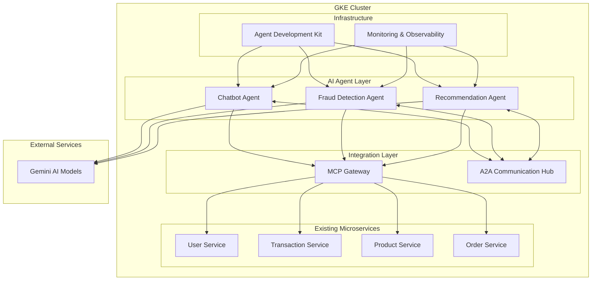

# Design Document

## Overview

The Agentic Microservices system enhances existing microservice applications (Bank of Anthos / Online Boutique) with intelligent AI agents deployed on Google Kubernetes Engine (GKE). The architecture follows a non-intrusive approach where AI agents operate as external containerized services that integrate via standardized protocols without modifying the core application code.

The system implements three primary AI agents (Chatbot, Fraud Detection, and Recommendation) that collaborate through Agent2Agent (A2A) protocol and integrate with existing microservices via Model Context Protocol (MCP). All agents leverage Gemini AI models for intelligent decision-making and are developed using the Agent Development Kit (ADK) for rapid deployment and orchestration.

## Architecture

### High-Level Architecture



### Deployment Architecture

The system deploys on GKE with the following namespace organization:

- `base-app`: Existing microservices (Bank of Anthos / Online Boutique)
- `ai-agents`: AI agent containers
- `integration`: MCP Gateway and A2A Communication Hub
- `infrastructure`: ADK, monitoring, and shared services

## Components and Interfaces

### AI Agent Components

#### Chatbot Agent

**Purpose**: Provides conversational customer support for transactions, orders, and account inquiries.

**Key Interfaces**:

- REST API endpoint for customer interactions
- WebSocket connection for real-time chat
- MCP client for microservice data access
- A2A client for inter-agent communication
- Gemini AI client for natural language processing

**Core Capabilities**:

- Natural language understanding and response generation
- Context-aware conversation management
- Multi-turn dialogue handling
- Escalation to human support when needed

#### Fraud Detection Agent

**Purpose**: Performs real-time analysis of transactions and user behavior to identify suspicious activities.

**Key Interfaces**:

- Event stream consumer for transaction events
- MCP client for historical data access
- A2A publisher for fraud alerts
- Gemini AI client for pattern analysis
- Alert notification system

**Core Capabilities**:

- Real-time transaction monitoring
- Machine learning-based anomaly detection
- Risk scoring and threshold management
- Automated response triggering

#### Recommendation Agent

**Purpose**: Generates personalized product and service recommendations based on user behavior and preferences.

**Key Interfaces**:

- REST API for recommendation requests
- MCP client for user and product data
- A2A client for cross-agent insights
- Gemini AI client for recommendation logic
- Caching layer for performance optimization

**Core Capabilities**:

- Collaborative filtering algorithms
- Content-based recommendation logic
- Real-time personalization
- A/B testing support for recommendation strategies

### Integration Components

#### Model Context Protocol (MCP) Gateway

**Purpose**: Provides standardized API integration between AI agents and existing microservices.

**Key Features**:

- Protocol translation and adaptation
- Authentication and authorization management
- Rate limiting and quota enforcement
- Request/response transformation
- Circuit breaker pattern implementation

**Interface Specifications**:

```yaml
# MCP Configuration Example
services:
  user-service:
    endpoint: "http://user-service:8080"
    auth: "bearer-token"
    rate_limit: "100/minute"
    timeout: "30s"
  
  transaction-service:
    endpoint: "http://transaction-service:8080"
    auth: "api-key"
    rate_limit: "200/minute"
    timeout: "15s"
```

#### Agent2Agent (A2A) Communication Hub

**Purpose**: Facilitates secure and efficient communication between AI agents.

**Key Features**:

- Message routing and delivery
- Event-driven communication patterns
- Message persistence and replay
- Security and access control
- Performance monitoring

**Communication Patterns**:

- **Request-Response**: Synchronous agent interactions
- **Publish-Subscribe**: Event-driven notifications
- **Message Queuing**: Asynchronous task processing

### Infrastructure Components

#### Agent Development Kit (ADK)

**Purpose**: Accelerates agent development, deployment, and management.

**Core Modules**:

- Agent scaffolding and templates
- Kubernetes deployment automation
- Configuration management
- Testing and validation frameworks
- Monitoring and observability integration

#### Monitoring and Observability

**Purpose**: Provides comprehensive system monitoring, logging, and alerting.

**Components**:

- Prometheus for metrics collection
- Grafana for visualization and dashboards
- Jaeger for distributed tracing
- ELK stack for centralized logging
- Custom alerting rules for agent-specific metrics

## Data Models

### Agent Communication Models

#### A2A Message Format

```json
{
  "messageId": "uuid",
  "timestamp": "2025-01-21T10:30:00Z",
  "sourceAgent": "fraud-detection",
  "targetAgent": "chatbot",
  "messageType": "alert",
  "priority": "high",
  "payload": {
    "alertType": "suspicious_transaction",
    "transactionId": "txn_12345",
    "riskScore": 0.85,
    "details": "Multiple high-value transactions in short timeframe"
  },
  "correlationId": "correlation_uuid"
}
```

#### MCP Request/Response Format

```json
{
  "requestId": "uuid",
  "timestamp": "2025-01-21T10:30:00Z",
  "agent": "recommendation",
  "service": "user-service",
  "operation": "getUserProfile",
  "parameters": {
    "userId": "user_12345",
    "includePreferences": true
  },
  "metadata": {
    "timeout": "30s",
    "retryPolicy": "exponential_backoff"
  }
}
```

### Agent State Models

#### Chatbot Conversation State

```json
{
  "sessionId": "uuid",
  "userId": "user_12345",
  "conversationHistory": [
    {
      "timestamp": "2025-01-21T10:30:00Z",
      "role": "user",
      "message": "What's my account balance?"
    },
    {
      "timestamp": "2025-01-21T10:30:15Z",
      "role": "assistant",
      "message": "Your current account balance is $2,450.75"
    }
  ],
  "context": {
    "currentTopic": "account_inquiry",
    "userIntent": "balance_check",
    "escalationLevel": 0
  }
}
```

#### Fraud Detection Model State

```json
{
  "userId": "user_12345",
  "riskProfile": {
    "baselineScore": 0.2,
    "currentScore": 0.85,
    "factors": [
      "unusual_transaction_amount",
      "off_hours_activity",
      "new_device_login"
    ]
  },
  "recentTransactions": [
    {
      "transactionId": "txn_12345",
      "amount": 5000.00,
      "timestamp": "2025-01-21T10:30:00Z",
      "riskScore": 0.9
    }
  ],
  "alertHistory": []
}
```

## Error Handling

### Agent-Level Error Handling

#### Graceful Degradation Strategy

- **Primary Mode**: Full AI-powered functionality
- **Degraded Mode**: Basic rule-based responses when AI services are unavailable
- **Fallback Mode**: Static responses and manual escalation when all automated systems fail

#### Error Categories and Responses

1. **Gemini AI Service Errors**
   - Timeout: Retry with exponential backoff
   - Rate Limit: Queue requests and implement circuit breaker
   - Service Unavailable: Switch to cached responses or rule-based logic

2. **MCP Integration Errors**
   - Authentication Failure: Refresh tokens and retry
   - Service Unavailable: Use cached data when possible
   - Data Format Errors: Log error and request manual intervention

3. **A2A Communication Errors**
   - Message Delivery Failure: Implement retry with dead letter queue
   - Agent Unavailable: Continue operation without cross-agent insights
   - Protocol Errors: Log and alert for system administrator review

### System-Level Error Handling

#### Circuit Breaker Pattern

```yaml
# Circuit Breaker Configuration
circuitBreaker:
  failureThreshold: 5
  recoveryTimeout: 30s
  halfOpenMaxCalls: 3
  monitoringPeriod: 60s
```

#### Retry Policies

```yaml
# Retry Configuration
retryPolicy:
  maxAttempts: 3
  backoffStrategy: "exponential"
  initialDelay: "1s"
  maxDelay: "30s"
  jitter: true
```

## Testing Strategy

### Unit Testing

- **Agent Logic Testing**: Mock external dependencies (Gemini, MCP, A2A)
- **Integration Testing**: Test MCP and A2A protocol implementations
- **Error Handling Testing**: Simulate failure scenarios and validate graceful degradation

### Integration Testing

- **End-to-End Workflows**: Test complete user journeys across agents
- **Cross-Agent Communication**: Validate A2A message flows and data consistency
- **External Service Integration**: Test Gemini AI and microservice API interactions

### Performance Testing

- **Load Testing**: Simulate high-volume agent interactions
- **Stress Testing**: Test system behavior under resource constraints
- **Scalability Testing**: Validate Kubernetes auto-scaling behavior

### Security Testing

- **Authentication Testing**: Validate MCP security mechanisms
- **Authorization Testing**: Test agent access controls and permissions
- **Data Privacy Testing**: Ensure sensitive data handling compliance

### Testing Environment Strategy

#### Local Development

- Docker Compose setup with mock services
- Lightweight Kubernetes cluster (kind/minikube)
- Gemini AI sandbox environment

#### Staging Environment

- Full GKE cluster with production-like configuration
- Real Gemini AI integration with test quotas
- Synthetic data for testing scenarios

#### Production Monitoring

- Canary deployments for new agent versions
- A/B testing framework for recommendation algorithms
- Real-time performance and accuracy monitoring

### Automated Testing Pipeline

```yaml
# CI/CD Pipeline Stages
stages:
  - unit_tests
  - integration_tests
  - security_scan
  - performance_tests
  - deployment_staging
  - e2e_tests
  - deployment_production
```

This design provides a robust, scalable, and maintainable architecture for enhancing existing microservices with intelligent AI agents while maintaining system reliability and performance.
