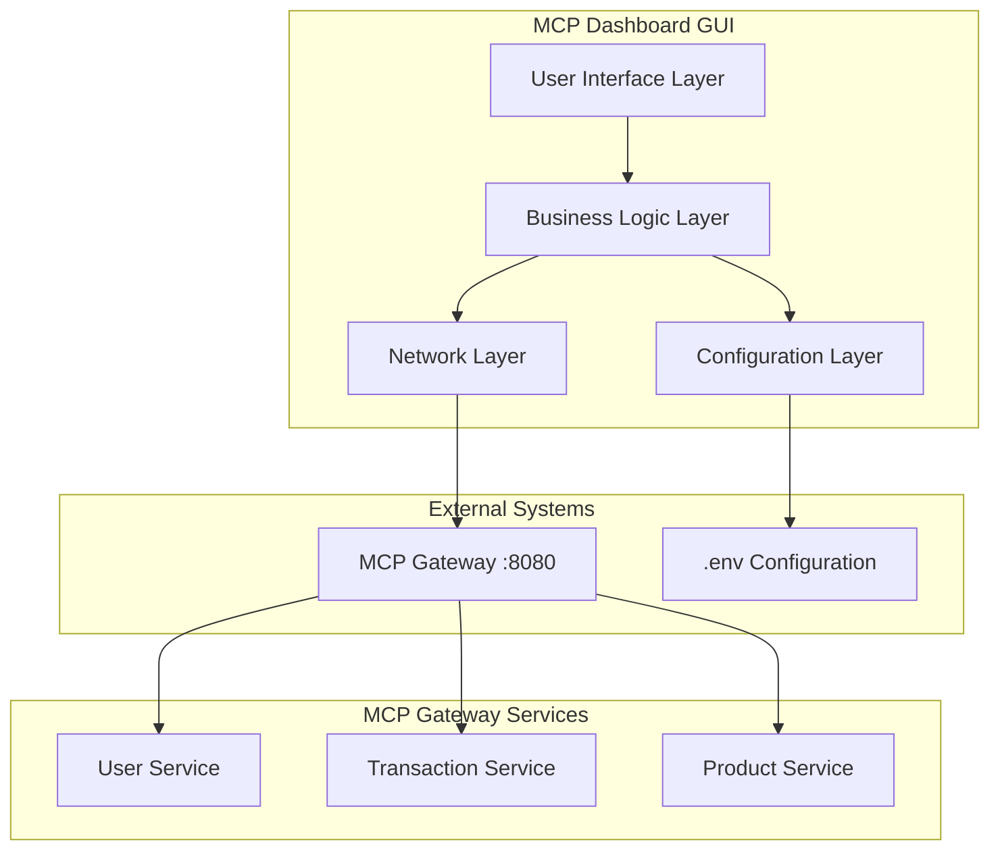

# Design Document

## Overview

The MCP Dashboard GUI is a standalone Python-based desktop application that provides a user-friendly interface for testing and monitoring MCP Gateway microservices. The application will be built using Tkinter for cross-platform compatibility and ease of deployment, with a modular architecture that supports dynamic service discovery and configuration-driven behavior.

The dashboard will serve as a development and testing tool, allowing developers to interact with the existing MCP Gateway infrastructure without requiring command-line knowledge or separate API testing tools.

## Architecture

### High-Level Architecture



### Application Structure

```
mcp-dashboard/
├── app.py                 # Main application entry point
├── requirements.txt       # Python dependencies
├── config/
│   ├── __init__.py
│   ├── env_loader.py     # Environment configuration loader
│   └── service_config.py # Service configuration management
├── ui/
│   ├── __init__.py
│   ├── main_window.py    # Main application window
│   ├── service_panel.py  # Service interaction panel
│   ├── health_monitor.py # Health status display
│   └── components/       # Reusable UI components
│       ├── __init__.py
│       ├── json_viewer.py
│       ├── request_form.py
│       └── status_indicator.py
├── services/
│   ├── __init__.py
│   ├── http_client.py    # HTTP request handling with retry logic
│   ├── health_checker.py # Service health monitoring
│   └── service_manager.py # Dynamic service management
└── utils/
    ├── __init__.py
    ├── logger.py         # Application logging
    └── validators.py     # Input validation utilities
```

## Components and Interfaces

### 1. Configuration Layer

**EnvLoader Class**

- Loads and parses .env.mcp-gateway.example configuration
- Extracts service definitions and connection parameters
- Provides configuration validation and error reporting

```python
class EnvLoader:
    def load_config(self, env_path: str) -> Dict[str, Any]
    def get_services(self) -> List[ServiceConfig]
    def get_gateway_config(self) -> GatewayConfig
    def validate_config(self) -> List[ValidationError]
```

**ServiceConfig Class**

- Represents individual service configuration
- Encapsulates service-specific settings (timeouts, auth, circuit breaker)

```python
@dataclass
class ServiceConfig:
    name: str
    endpoint: str
    auth_type: str
    timeout: int
    retry_config: RetryConfig
    circuit_breaker_config: CircuitBreakerConfig
    sample_endpoints: List[str]
```

### 2. Network Layer

**HttpClient Class**

- Handles HTTP requests with retry logic and circuit breaker patterns
- Implements timeout handling based on service configuration
- Provides request/response logging and error handling

```python
class HttpClient:
    def __init__(self, service_config: ServiceConfig)
    async def make_request(self, method: str, endpoint: str, **kwargs) -> Response
    def _implement_retry_logic(self, request_func) -> Response
    def _check_circuit_breaker(self) -> bool
```

**HealthChecker Class**

- Monitors service health status in real-time
- Implements periodic health checks with configurable intervals
- Provides health status change notifications

```python
class HealthChecker:
    def __init__(self, services: List[ServiceConfig])
    async def check_service_health(self, service: ServiceConfig) -> HealthStatus
    def start_monitoring(self, callback: Callable[[str, HealthStatus], None])
    def stop_monitoring(self)
```

### 3. Business Logic Layer

**ServiceManager Class**

- Manages dynamic service discovery and configuration
- Coordinates between UI components and network layer
- Handles service-specific business logic

```python
class ServiceManager:
    def __init__(self, config_loader: EnvLoader)
    def get_available_services(self) -> List[ServiceConfig]
    def execute_request(self, service_name: str, endpoint: str, method: str) -> RequestResult
    def get_sample_endpoints(self, service_name: str) -> List[EndpointInfo]
```

### 4. User Interface Layer

**MainWindow Class**

- Primary application window using Tkinter
- Manages overall layout and component coordination
- Handles application lifecycle and event management

```python
class MainWindow:
    def __init__(self, service_manager: ServiceManager)
    def setup_ui(self)
    def on_service_selected(self, service_name: str)
    def update_health_status(self, service_name: str, status: HealthStatus)
```

**ServicePanel Class**

- Service-specific interaction panel
- Contains endpoint input, request controls, and response display
- Handles request execution and result presentation

```python
class ServicePanel:
    def __init__(self, parent, service_config: ServiceConfig)
    def setup_controls(self)
    def execute_request(self, endpoint: str, method: str)
    def display_response(self, response: RequestResult)
    def load_sample_endpoints(self)
```

## Data Models

### Core Data Structures

```python
@dataclass
class RequestResult:
    success: bool
    status_code: int
    response_data: Dict[str, Any]
    response_time: float
    error_message: Optional[str]
    retry_attempts: int

@dataclass
class HealthStatus:
    service_name: str
    is_healthy: bool
    last_check: datetime
    response_time: Optional[float]
    error_details: Optional[str]

@dataclass
class RetryConfig:
    max_attempts: int
    strategy: str  # 'exponential', 'linear', 'fixed'
    initial_delay: int
    max_delay: int
    jitter: bool

@dataclass
class CircuitBreakerConfig:
    failure_threshold: int
    recovery_timeout: int
    half_open_max_calls: int
```

### Configuration Models

```python
@dataclass
class GatewayConfig:
    url: str
    port: int
    default_timeout: int
    retry_config: RetryConfig

@dataclass
class EndpointInfo:
    path: str
    method: str
    description: str
    sample_payload: Optional[Dict[str, Any]]
```

## Error Handling

### Error Categories

1. **Configuration Errors**
   - Missing or invalid .env file
   - Malformed service configurations
   - Network connectivity issues

2. **Runtime Errors**
   - Service unavailability
   - Request timeouts
   - Authentication failures
   - Circuit breaker activation

3. **UI Errors**
   - Invalid user input
   - Display rendering issues
   - Component interaction failures

### Error Handling Strategy

```python
class ErrorHandler:
    def handle_config_error(self, error: ConfigError) -> UserMessage
    def handle_network_error(self, error: NetworkError) -> UserMessage
    def handle_ui_error(self, error: UIError) -> UserMessage
    def log_error(self, error: Exception, context: str)
```

### User Feedback Mechanisms

- Status bar messages for real-time feedback
- Modal dialogs for critical errors
- Inline validation messages for input fields
- Color-coded status indicators for service health
- Detailed error logs accessible through UI

## Testing Strategy

### Unit Testing

- **Configuration Layer**: Test environment loading, validation, and parsing
- **Network Layer**: Mock HTTP requests, retry logic, circuit breaker behavior
- **Business Logic**: Service management, request coordination, error handling
- **UI Components**: Widget behavior, event handling, data binding

### Integration Testing

- **End-to-End Workflows**: Complete request cycles from UI to MCP Gateway
- **Service Discovery**: Dynamic service loading and configuration updates
- **Health Monitoring**: Real-time status updates and notifications
- **Error Scenarios**: Network failures, service unavailability, timeout handling

### Testing Tools and Framework

```python
# Test structure
tests/
├── unit/
│   ├── test_config/
│   ├── test_network/
│   ├── test_services/
│   └── test_ui/
├── integration/
│   ├── test_workflows/
│   ├── test_health_monitoring/
│   └── test_error_handling/
└── fixtures/
    ├── sample_configs/
    └── mock_responses/
```

### Mock Strategy

- Mock MCP Gateway responses for consistent testing
- Simulate network conditions (timeouts, failures, slow responses)
- Mock configuration scenarios (missing files, invalid formats)
- UI testing with automated interaction simulation

## Implementation Considerations

### Technology Choices

**Python + Tkinter**

- Cross-platform compatibility without additional dependencies
- Native look and feel on all operating systems
- Simplified packaging and distribution
- Built-in support for threading and async operations

**Alternative Considered: React.js**

- Would require Node.js runtime and build process
- More complex deployment and packaging
- Better for web-based interfaces but overkill for desktop tool

### Performance Optimizations

1. **Asynchronous Operations**
   - Non-blocking HTTP requests using asyncio
   - Background health monitoring without UI freezing
   - Concurrent service status checks

2. **Caching Strategy**
   - Cache service configurations to avoid repeated parsing
   - Store recent request results for quick reference
   - Cache health status to reduce unnecessary checks

3. **Resource Management**
   - Connection pooling for HTTP requests
   - Proper cleanup of background threads
   - Memory-efficient JSON response handling

### Security Considerations

1. **Credential Handling**
   - Secure storage of authentication tokens
   - No hardcoded credentials in source code
   - Environment-based configuration only

2. **Network Security**
   - HTTPS enforcement where applicable
   - Request validation and sanitization
   - Timeout enforcement to prevent hanging connections

3. **Input Validation**
   - URL validation for endpoint inputs
   - JSON payload validation
   - Protection against injection attacks

### Extensibility Features

1. **Plugin Architecture**
   - Service-specific UI customizations
   - Custom authentication handlers
   - Extensible endpoint templates

2. **Configuration-Driven Behavior**
   - Dynamic service discovery from environment
   - Configurable UI layouts and themes
   - Customizable sample endpoint definitions

3. **Export/Import Capabilities**
   - Export request history and results
   - Import custom service configurations
   - Save and restore application state
